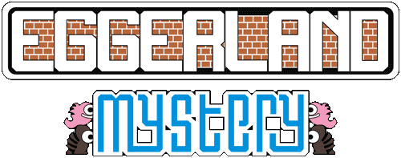

<h1 align="center">
    
    <p> An Object-Oriented Programming Project! 👾 </p>
</h1>

## 🚨 About

This is a recriation of the first four fases of Eggerland Mystery, programmed by Object-Oriented Programming on Java!

## 🔨 Tools

- Add moving by WASD

## 🕹️ How to run

```bash
    # Clone the project
    $ git clone https://github.com/marceloreginato/ProjetoEggerlandMistery.git

```

```bash
    # Enter directory
    cd ProjetoEggerlandMistery/src
```

```bash
    # Compile and run
    javac Main.java
    java Main
```

## 📄 Work Organization

- Trello: https://trello.com/b/O1CR4XKw/eggerlandmistery 

- Drive: https://drive.google.com/drive/folders/1jZGmg1upqm86mh_-i4Ap5uc_y1xX3w1c?usp=sharing 

- Github: https://github.com/marceloreginato/SCC0604-2023


## 👥 Project Owners

- Marcelo Eduardo Reginato 13676965

- Rhayna Christiani Vasconcelos Marques Casado 13676429